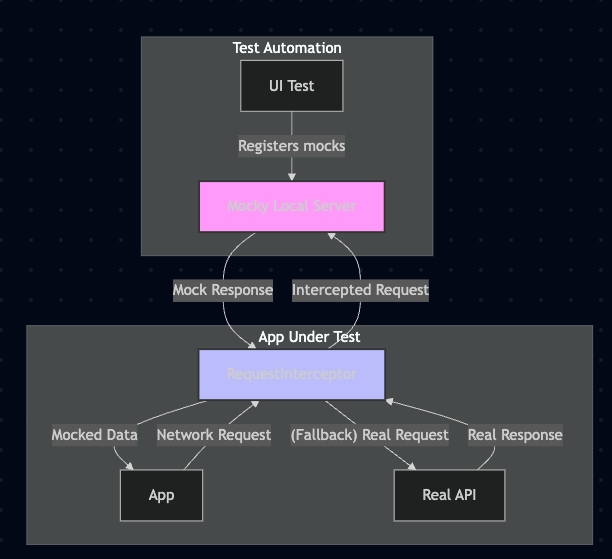
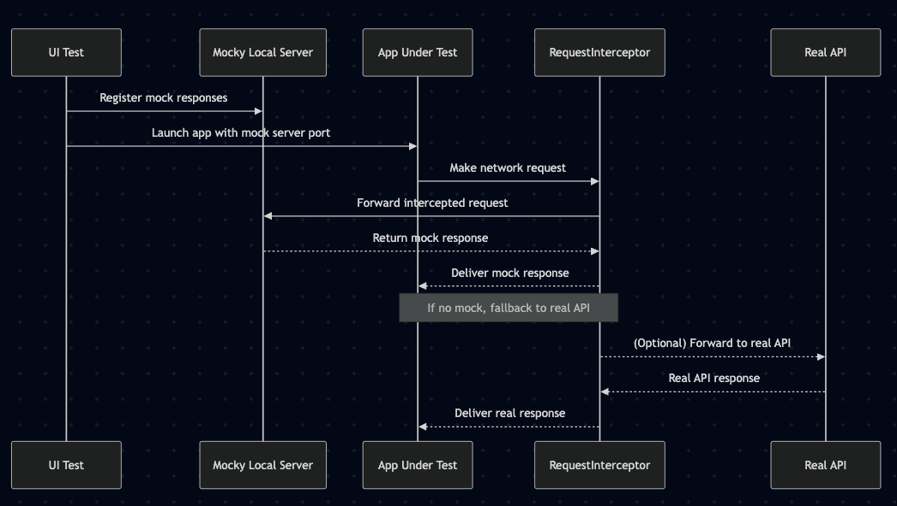

# Mocky

Effortless API mocking for iOS apps and tests. Instantly intercept network requests and provide custom responses—with simple setup.


## Features

- **Zero-Code Mocking:** Mock API responses at app launch, no production code changes needed.
- **Powerful Interception:** Replace network requests with local mock data for any domain.
- **Seamless UI Testing:** Control and verify user flows, edge cases, and network errors.
- **Flexible Architecture:** Works with any `URLSession`-based networking.


# Quick Start

### 1. Add Mocky to Your Project

Add Mocky as a Swift Package.  
File > Swift Packages > Add Package Dependency
```
https://github.com/hanlinchentw/Mocky.git
```

### 2. Prepare Your Mock Data

Place your mock JSON files in your test bundle (e.g., see [Mock.json](Example/ExampleUITests/Mock.json)).

### 3. Write a UI Test

```swift
import MockyXCTestHelpers
import XCTest

final class ExampleUITests: UITestCases {
    func testExample() {
        mockFile("Mock.json", for: "/api/v2/pokemon")
        app.launch()
        XCTAssertTrue(app.cells[A11Y.cell(for: "Leo")].waitForExistence(timeout: 5))
    }
}
```

### 4. Enable Mocking in Your App

In your App's starting point like `AppDelegate.didFinishLaunch`, enable Mocky for your test domains:

```swift
import MockyCore

#if DEBUG
if ProcessInfo.isTestAutomation {
    Mocky.start(domains: [Constants.POKEMON_SERVER_HOST])
}
#endif
```

---

## How It Works

### Architecture

- **RequestInterceptor:** Swizzles `URLSession` to intercept requests for specified domains.
- **LocalServer:** Listens on localhost for mock requests from the app.
- **ClientConnection:** Sends requests from the app to the local server and receives mock responses.




### Flow

1. **Test Setup:** Start the local server and register mock responses.
2. **App Launch:** App receives launch arguments with the mock server port.
3. **Intercepted Request:** `RequestInterceptor` catches network requests.
4. **Mock Response:** App requests mock data from the local server, which responds with your JSON.



---

## Advanced Usage

- **Custom Domains:** Pass any set of domains to `Mocky.start(domains:)`.
- **Multiple Mocks:** Register as many mock files as needed for different endpoints.
- **Custom Headers:** Provide custom response headers via `mockFile(_:for:headers:)`.

---

## Example

See [Example/ExampleUITests/ExampleUITests.swift](Example/ExampleUITests/ExampleUITests.swift) for a full test case.

---
